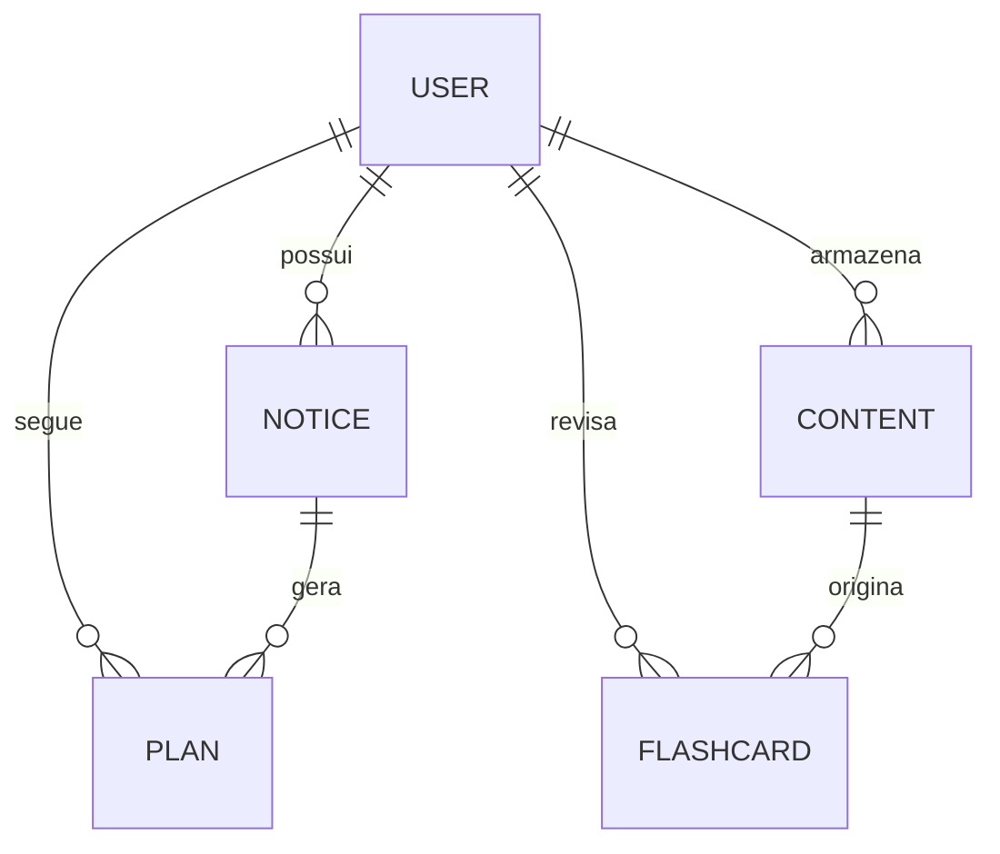

# PRD - AEstudamos: Ecossistema Inteligente de Aprovação

## 1. Visão Geral do Produto
O **AEstudamos** é uma plataforma "all-in-one" de preparação para concursos e exames de alto nível. Utilizando Inteligência Artificial de ponta (Gemini API), a plataforma automatiza o ciclo completo do estudante: desde a análise bruta de editais e criação de cronogramas personalizados até a geração de materiais de revisão (flashcards) e suporte pedagógico 24/7 via tutor inteligente.

## 2. Objetivos Estratégicos
- **Eliminar a Paralisia de Planejamento:** Automatizar a extração de tópicos e a criação de cronogramas.
- **Maximização da Retenção:** Implementar Repetição Espaçada (SRS) automática para combater a curva do esquecimento.
- **Centralização de Conteúdo:** Unificar PDFs, videoaulas e anotações em um acervo dinâmico e inteligente.
- **Suporte Individualizado:** Oferecer um tutor de IA que compreende o contexto específico do material de estudo do usuário.

## 3. Funcionalidades Detalhadas

### 3.1. Gestão Inteligente de Editais (`/editais`)
- **Importação Multimodal:** Suporte para links (ex: QConcursos), upload de PDFs ou colagem manual de texto (incluindo HTML de plataformas como Hotmart).
- **Extração via IA:** Identificação automática de disciplinas, pesos, importância e lista detalhada de tópicos.
- **Cruzamento de Matérias:** Capacidade de analisar o que é comum entre diferentes editais para otimizar o estudo incremental.
- **Status de Cobertura:** Controle granular do progresso em cada tópico (Teoria, Questões, Revisão).

### 3.2. Planejamento de Estudos Dinâmico (`/planos`)
- **Geração Automática:** Criação de cronogramas baseados na carga horária diária do usuário e na data da prova.
- **Visualização Vertical:** Lista linear de tópicos para controle de "check-list" de edital.
- **Visualização Calendário:** Agenda diária com distribuição inteligente de matérias.
- **Estimativa de Conclusão:** Cálculo em tempo real de quando o usuário terminará o edital com base no ritmo atual.
- **Controle de Tempo Real:** Timer integrado para registrar o tempo real de estudo vs. tempo planejado.

### 3.3. Acervo Inteligente de Disciplinas (`/acervo`)
- **Categorização Dinâmica:** Disciplinas criadas automaticamente no momento da importação.
- **Suporte a Mídias:** Armazenamento e visualização de PDFs, textos ricos e links de YouTube.
- **Análise de Conteúdo via IA:** Geração automática de resumos e extração de tópicos-chave para cada material importado.
- **Geração de Flashcards:** Botão "mágico" que transforma qualquer material do acervo em um deck de flashcards prontos para estudo.

### 3.4. Sistema de Flashcards (SRS) (`/flashcards`)
- **Algoritmo de Repetição Espaçada:** Lógica baseada em Anki para otimizar a memorização de longo prazo.
- **Interface de Estudo Ativo:** Modo de revisão focado com feedback imediato de dificuldade (Fácil, Médio, Difícil).
- **Biblioteca Organizada:** Busca e filtragem de cards por disciplina e data de revisão.

### 3.5. Tutor IA e Suporte (`/tutor`)
- **Chat Contextual:** Tutor que responde dúvidas baseando-se nos materiais do usuário.
- **Explicações Simplificadas:** Capacidade de pedir para a IA "explicar como se eu tivesse 5 anos" sobre tópicos complexos do edital.

---

## 4. Interfaces e UX
A plataforma utiliza uma estética **"Modern Dark/Light Professional"** com foco em legibilidade e redução de carga cognitiva.

- **Sidebar de Navegação:** Acesso rápido a todos os módulos (Dashboard, Editais, Acervo, Flashcards, Tutor).
- **Modais de Importação:** Fluxos guiados para adição de novos conteúdos.
- **Badges de Status:** Identificação visual rápida de importância de matérias e prazos.
- **Feedback Visual:** Uso de `sonner` para notificações e `framer-motion` para transições suaves entre estados.

---

## 5. Arquitetura de Dados (Firestore)

### 5.1. Entidades e Esquemas

#### `users` (Coleção)
- `uid`: string (PK)
- `name`, `surname`, `email`: string
- `role`: 'user' | 'admin'
- `enrolledContest`: string (referência ao edital principal)

#### `notices` (Coleção)
- `id`: string (PK)
- `uid`: string (FK)
- `name`: string
- `content`: string (texto bruto do edital)
- `subjects`: Array<{ name, weight, importance, topics: string[], progress }>
- `examDate`: timestamp

#### `plans` (Coleção)
- `id`: string (PK)
- `uid`: string (FK)
- `notices`: string[] (IDs dos editais relacionados)
- `schedule`: Array<{ day, topics: Array<{ title, subject, duration, completed, startTime, endTime, actualDuration, type }> }>

#### `content` (Coleção - Acervo)
- `id`: string (PK)
- `uid`: string (FK)
- `title`, `type` (pdf/text/video), `content` (URL ou texto): string
- `subject`: string
- `summary`: string
- `topics`: string[]

#### `flashcards` (Coleção)
- `id`: string (PK)
- `uid`: string (FK)
- `question`, `answer`, `subject`: string
- `nextReview`: timestamp
- `difficulty`: 'easy' | 'medium' | 'hard'
- `interval`, `easeFactor`, `repetitions`: number (Dados do algoritmo SRS)

### 5.2. Relacionamentos (ERD)

---

## 6. Stack Tecnológica
- **Core:** React 19 + TypeScript + Vite.
- **UI/UX:** Tailwind CSS + Shadcn/UI + Lucide Icons + Framer Motion.
- **Backend:** Firebase (Authentication, Firestore, Storage).
- **Inteligência Artificial:** Google Generative AI (Gemini 1.5 Flash para análise rápida e Pro para geração complexa).
- **Gestão de Estado:** React Hooks (Context API para Auth).
- **Métricas:** Recharts para visualização de dados.
