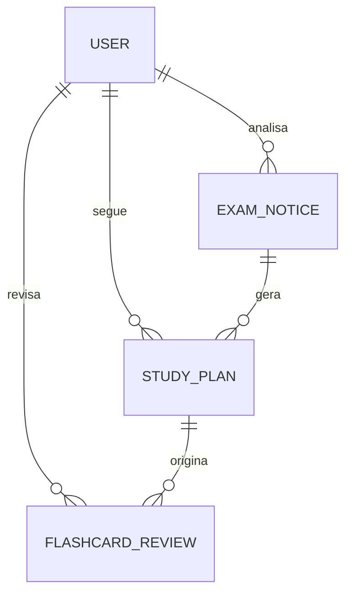

# PRD - AEstudamos: Plataforma Inteligente de Estudos

## 1. Visão Geral do Produto
O **AEstudamos** é um ecossistema completo de preparação para concursos e exames, que utiliza Inteligência Artificial (Gemini API) para automatizar a organização, criação de materiais e acompanhamento do desempenho do estudante. A plataforma integra análise de editais, planejamento de estudos, flashcards com repetição espaçada e tutoria inteligente.

## 2. Objetivos
- **Automatização:** Reduzir o tempo gasto na organização manual de editais e planos de estudo.
- **Eficiência:** Otimizar a memorização através de repetição espaçada e estudo ativo.
- **Personalização:** Adaptar o ritmo de estudo ao desempenho real do usuário.
- **Centralização:** Reunir todas as ferramentas de estudo (cronograma, material, tutor e métricas) em um único lugar.

## 3. Funcionalidades Principais

### 3.1. Gestão de Editais (Análise e Extração)
- **Importação de Editais:** Upload de textos ou PDFs de editais de concursos.
- **Extração Inteligente:** A IA identifica automaticamente as disciplinas, tópicos e sub-tópicos do edital.
- **Cruzamentos:** Capacidade de analisar múltiplos editais para identificar conteúdos comuns e divergentes (estudo incremental).
- **Status de Cobertura:** Acompanhamento visual do que já foi estudado em cada tópico do edital.

### 3.2. Planos de Estudo (Vertical e Calendário)
- **Plano de Estudo Vertical:** Organização linear de todos os tópicos do edital, permitindo marcar "Teoria", "Questões" e "Revisão" para cada item.
- **Calendário de Estudos:** Distribuição automática da carga horária semanal entre as disciplinas, gerando uma agenda diária.
- **Flexibilidade:** Ajuste manual de horas diárias e metas de estudo.
- **Pomodoro Timer:** Cronômetro integrado para ciclos de estudo focado com intervalos.

### 3.3. Flashcards Inteligentes (Spaced Repetition)
- **Geração Multimodal:** Criação de cards a partir de textos, PDFs, imagens ou links de vídeos (YouTube).
- **Algoritmo de Repetição Espaçada (Estilo Anki):**
    - **Fácil:** Revisão em **1 dia**.
    - **Médio:** Revisão em **30 minutos**.
    - **Difícil:** Revisão em **10 minutos**.
- **Biblioteca de Cards:** Organização por disciplinas e busca global.

### 3.4. Tutor IA
- **Chat Interativo:** Tutor disponível 24/7 para tirar dúvidas sobre qualquer conteúdo.
- **Contextualização:** O tutor pode acessar o contexto dos planos de estudo e editais do usuário para fornecer respostas mais precisas.

### 3.5. Dashboard e Analytics
- **Métricas de Desempenho:** Gráficos de precisão nos flashcards e horas de estudo semanais.
- **Ofensiva (Streak):** Gamificação para incentivar a constância diária.
- **Progresso por Disciplina:** Visualização clara da porcentagem de conclusão de cada matéria.

---

## 4. Arquitetura de Dados

O sistema utiliza uma estrutura robusta baseada em **Firebase (Firestore)** para sincronização em tempo real e **LocalStorage** para cache e performance de decks.

### 4.1. Entidades Principais (Firestore)

#### A. Users
- `uid`: ID único do Firebase Auth.
- `email`: E-mail do usuário.
- `role`: Nível de acesso (user/admin).

#### B. ExamNotices (Editais)
- `id`: ID do edital.
- `name`: Nome do concurso.
- `subjects`: Lista de disciplinas e tópicos extraídos.
- `examDate`: Data da prova.

#### C. StudyPlans
- `id`: ID do plano.
- `goal`: Objetivo do plano.
- `schedule`: Array de dias com disciplinas e tópicos alocados.
- `viewMode`: Preferência do usuário (vertical/calendar).

#### D. FlashcardReviews
- `uid`: Referência ao usuário.
- `deckId / cardId`: Referência ao card original.
- `nextReviewDate`: Timestamp para a próxima aparição na fila.
- `status`: Nível de dificuldade atual.

### 4.2. Relacionamentos

---

## 5. Tecnologias Utilizadas
- **Frontend:** React + Vite + TypeScript.
- **Estilização:** Tailwind CSS + Shadcn/UI.
- **Animações:** Framer Motion.
- **Backend/DB:** Firebase (Auth & Firestore).
- **IA:** Google Generative AI (Gemini 1.5 Pro/Flash).
- **Gráficos:** Recharts.
